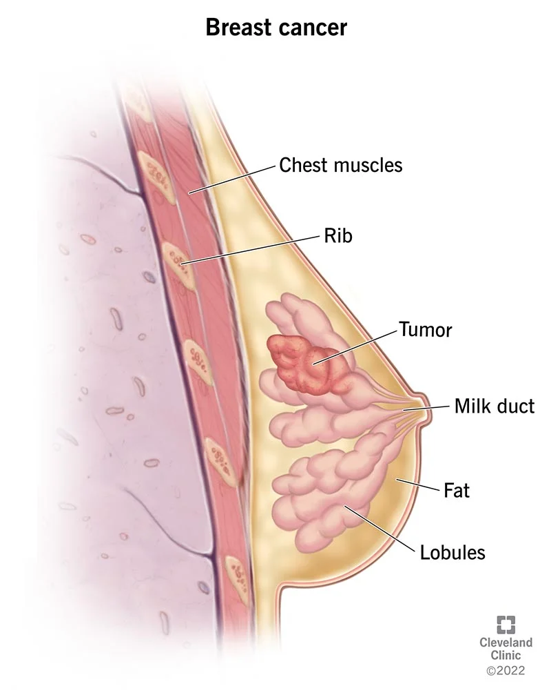
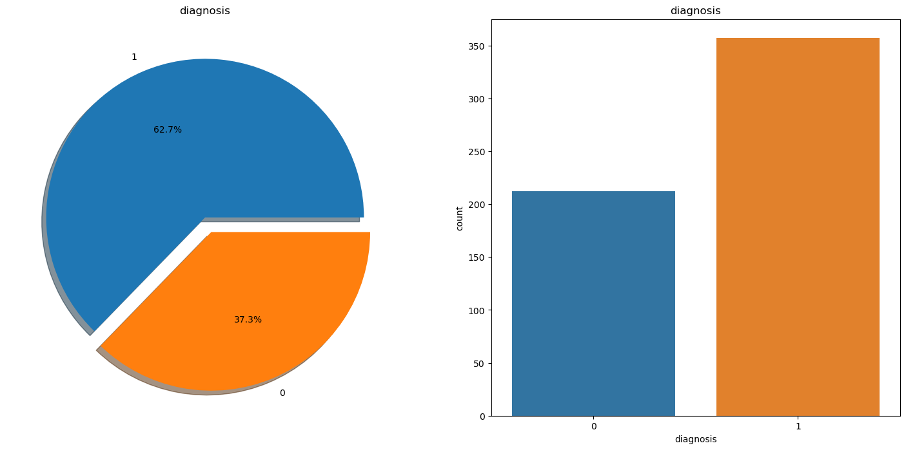
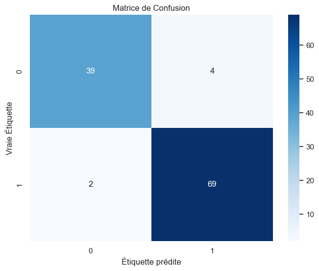

# Classification du Cancer du Sein

## Introduction et Contexte
Le cancer du sein est l’un des cancers les plus courants chez les femmes. Ce projet utilise un modèle Naive Bayes Gaussien pour classifier les tumeurs mammaires comme malignes (cancéreuses) ou bénignes (non cancéreuses) à partir des données fournies par l'ensemble de données du cancer du sein de l'Université du Wisconsin.


## Ensemble de Données
L'ensemble de données contient 569 instances avec 6 caractéristiques:
- **mean_radius**: La moyenne de la distance entre le centre et le périmètre de la cellule.
- **mean_perimeter**: La moyenne du périmètre.
- **mean_area**: La moyenne de l'aire de la cellule.
- **mean_texture**: La moyenne des valeurs d'échelle de gris.
- **mean_smoothness**: La moyenne des longueurs de rayon.
- **diagnosis**: La variable cible, où "1" signifie tumeur maligne et "0" signifie tumeur bénigne.


## Analyse de Dataset



## Prérequis
Pour exécuter ce projet, vous avez besoin des bibliothèques Python suivantes :
- numpy
- pandas
- scikit-learn
- matplotlib
- seaborn

Vous pouvez les installer via pip :
```bash
pip install numpy pandas scikit-learn matplotlib seaborn

## Utilisation

```bash
git clone https://github.com/amine-sabbahi/Classification-Cancer-du-Sein.git

```bash
cd Classification-Cancer-du-Sein

## Résultats

Le modèle Naive Bayes Gaussien a obtenu une précision de 95% et un score F1 de 96%. La matrice de confusion et le rapport de classification détaillent davantage les performances du modèle.
